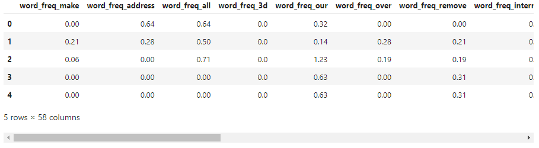

# $${\color{green}Classification-Challenge \space(Predictive \space Modeling \space Project) }$$
Logistic Regression &amp; Random Forest Model

## Predictive Modeling with Logistic Regression and Random Forest Classifier

>> Logistic Regression is a statistical method used for binary classification problems (e.g. Spam email or not Spam email, which predicts the probability of a binary outcome based on one or more predictor variables. It shows how the outcome (yes or no) depends on other factors and calculates the chances of each outcome, making it easy to understand the results. Logistic Regression is favored for its simplicity and efficiency, especially when the relationship between variables is approximately linear.

>> Random Forest, on the other hand, is a supervised learning method that uses many decision trees to make better predictions. Each tree gives a vote, and the most common vote becomes the final prediction. Random Forest is highly effective for capturing complex interactions and non-linear relationships within the data.

>> In this project, we use both Logistic Regression and Random Forest models to predict whether an email is spam email. By leveraging these models, we aim to accurately classify emails as spam or not spam, improving email management and user experience.


### Requirements
- numPy
- pandas
- scikit-learn
- matplotlib
- seaborn

You can install these packages using pip. Ensure you have Python 3.6 or later.

## Predictive Modeling Analysis included the following: 

### Import Data

  
### Exploratory Analysis
- Simply exploratory analysis was used to assess the data content and basic statistics.
- The aim purpose was to confirm there were no issues with the data. 
```
data.dtypes
data.columns
data.shape
data.info()
```
## Logistic Regression Model
#### 1. Train-Test Split:
- Splitting the Data into Training and Testing Sets
```
X_train, X_test, y_train, y_test = train_test_split(X, y, random_state=1)
```
- Scaling the Features
```
from sklearn.preprocessing import StandardScaler
scaler = StandardScaler().fit(X_train)
X_train_scaled = scaler.transform(X_train)
X_test_scaled = scaler.transform(X_test)
```
#### 2. Train the Model:
```
from sklearn.linear_model import LogisticRegression
logreg_model = LogisticRegression(random_state=1).fit(X_train_scaled, y_train)
```
#### 3. Evaluate Performance:
```
from sklearn.metrics import accuracy_score, classification_report

y_predict = logreg_model.predict(X_test_scaled)
Logreg_testing_predictions = accuracy_score(y_test, y_predict)
print("Accuracy Score:", Logreg_testing_predictions)
```

## Random Forest Classifier Model
#### 1. Train-Test Split:
- This part uses the same train-test split as described in the Logistic Regression section.
#### 2. Train the Model:
```
from sklearn.ensemble import RandomForestClassifier
rfclassifier = RandomForestClassifier(random_state=1)
rfclassifier.fit(X_train_scaled,y_train)
```
#### 4. Evaluate Performance:
```
y_predict_rf = rfclassifier.predict(X_test_scaled)
rf_testing_predictions = accuracy_score(y_test, y_predict_rf)

print("Accuracy Score:", rf_testing_predictions)
```
## Interpretation of Results
#### Logistic Regression
#### Accuracy Score: 0.92

>> The accuracy score of the Logistic Regression model represents the proportion of correctly classified instances over the total number of instances in the test dataset. A higher accuracy indicates that the model is effectively capturing the relationship between the features and the target variable. However, accuracy alone may not be sufficient, especially in cases of class imbalance.

#### Random Forest Classifier
#### Accuracy Score:  0.96

>> The accuracy score of the Random Forest Classifier reflects the model's performance in classifying instances correctly. Random Forest often performs well due to its ensemble approach, which aggregates predictions from multiple decision trees to improve overall accuracy and reduce overfitting.

#### Classification Report:

>> As with Logistic Regression, the classification report for Random Forest includes precision, recall, and F1-score for each class. Random Forest's robustness typically results in higher precision and recall compared to simpler models, especially when dealing with complex datasets.
